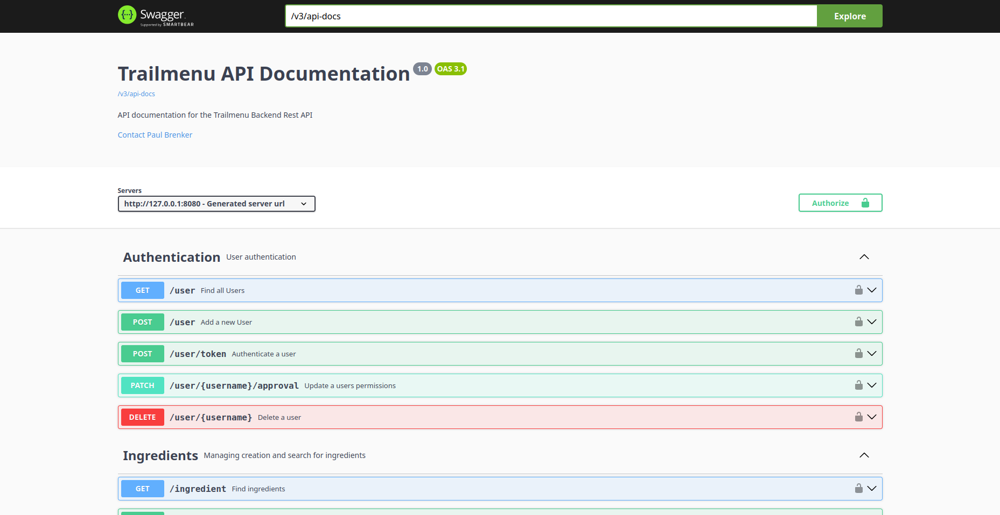

# Trailmenu

Trailmenu is the **central backend service** for the **Trailmenu** Outdoor Meal Planner.
It provides HTTP REST endpoints for core functionallity, along with built-in user and authentication management.



---

## 📑 Table of Contents

- [Getting Started](#-getting-started)
- [Database](#database)
- [Run the App](#run-the-app)
- [OpenAPI](#openapi)
- [Testing](#testing)

---

## 🚀 Getting Started

This project requires **Java 21 (Temurin distribution)**.  
We recommend installing it via [SDKMAN](https://sdkman.io/):

```bash
sdk install java 21-tem
```

## Database

A local PostgreSQL instance is required. You can start it with Docker:

```bash
docker compose up -d postgres
```

## Run the app

For development purposes, run the application using:

```bash
./gradlew bootRun
```

Alternatively, you can build and run the full stack (app + database) with Docker:

```bash
docker compose up --build```
```

### OpenAPI

API endpoints and authentication are documented via OpenAPI & Swagger UI.

- [Localhost](http://127.0.0.1:8080/swagger-ui/index.html#/)
- [Production](https://api.pbrenk.com/swagger-ui/index.html#/)

### Testing

Run tests with:

```bash
./gradlew test
```

- Test coverage is automatically **enforced at 80%.**
- Coverage reports can be found
  here: [Jacoco Report](http://localhost:63342/core/build/reports/jacoco/test/html/index.html?) .